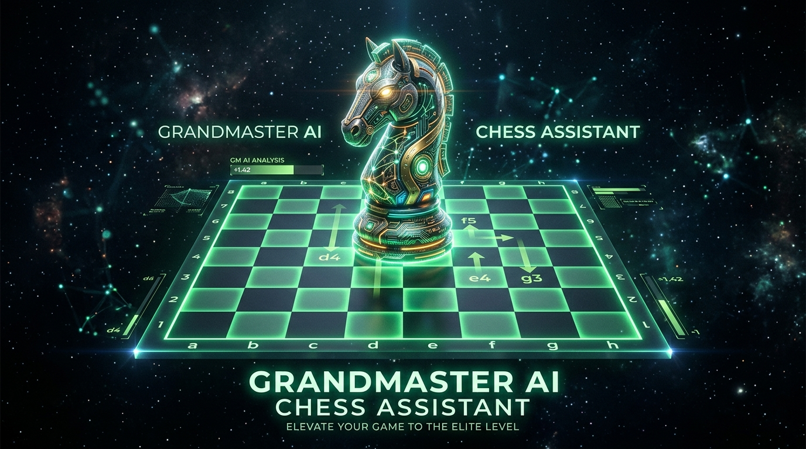
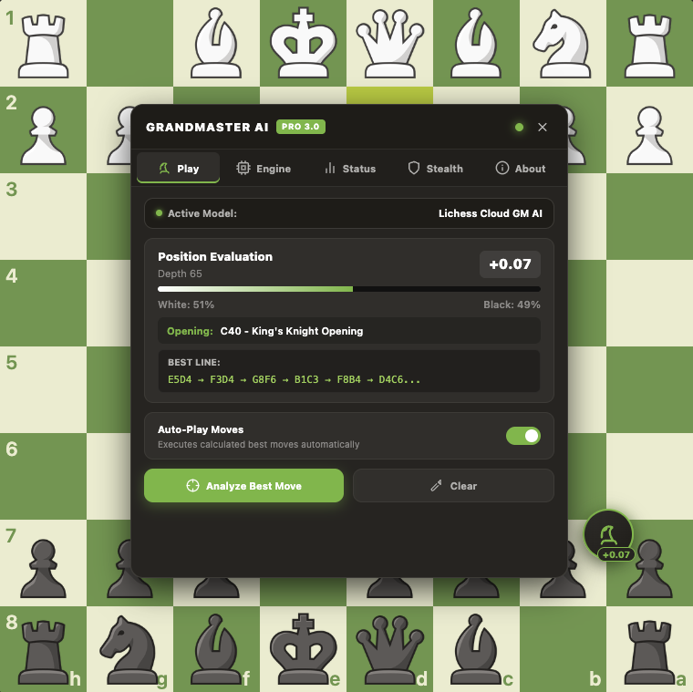
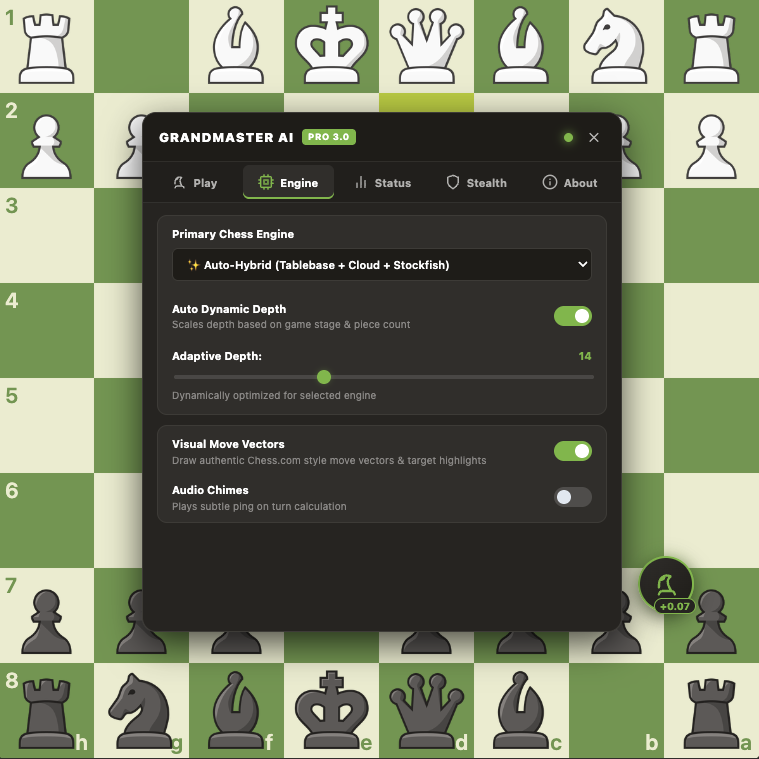
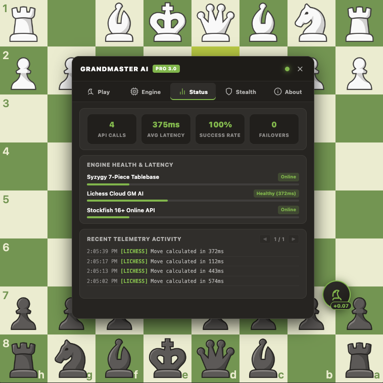
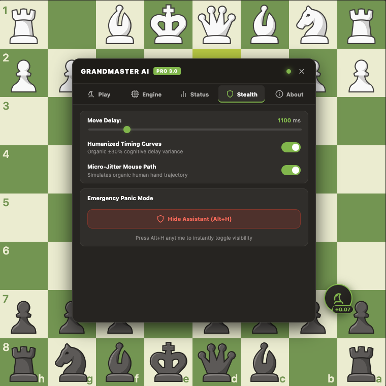
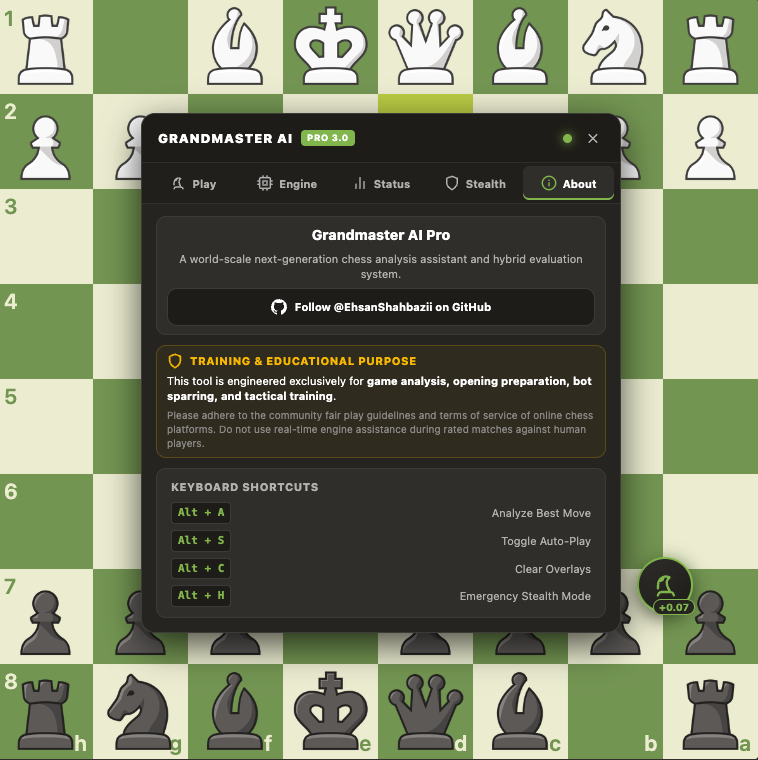
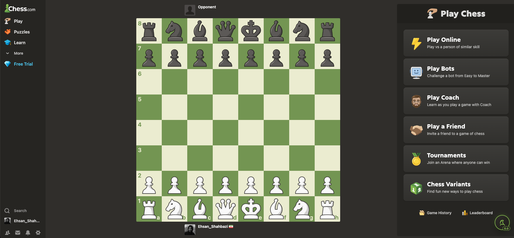

# 👑 Grandmaster AI — Chess Assistant Pro (v3.0)

> [!CAUTION]
> **PAY ATTENTION: ACCOUNT BAN ALERT**
>
> Using this extension during live, rated matches against human players on **Chess.com**, **Lichess.org**, or other platforms constitutes a direct violation of their Fair Play Policies and Terms of Service. 
>
> Platform anti-cheat algorithms monitor behavioral telemetry, engine correlation, and input timing. **Improper use will result in permanent account suspension and hardware/IP bans.** Use this software exclusively for post-game analysis, offline studies, opening preparation, or against unrated bots.

<p align="center">
  
</p>

<p align="center">
  <a href="https://github.com/EhsanShahbazii"></a>
  
  
  <a href="LICENSE"></a>
</p>

---

## 📖 Overview

**Grandmaster AI - Chess Assistant Pro** is an open-source, world-scale browser extension engineered for **Chess.com** and **Lichess.org**. Designed and developed by **[Ehsan Shahbazi](https://github.com/EhsanShahbazii)**, it delivers Grandmaster-level real-time positional evaluation, opening recognition, and dynamic move recommendations through an **Auto-Hybrid Multi-Engine Cascade**.

Built with an authentic **Chess.com Dark Emerald** palette, the extension features a 480px locked, no-scroll glassmorphic HUD, organic mouse simulation, emergency panic stealth hotkeys, and a real-time API telemetry monitor with pagination.

---

## ⚡ Key Highlights

- **👑 Auto-Hybrid Engine Cascade**: Intelligently queries Syzygy 7-Piece Endgame Tablebase when $\le 7$ pieces remain, probes Lichess Cloud GM database (depth 45–55+), and executes Stockfish 16+ Online API with dynamic depth scaling and automatic failover.
- **🤖 Auto-Dynamic Depth Scaling**: Automatically computes the optimal search depth per turn based on tactical complexity, piece count, and game phase (opening, middlegame, endgame).
- **📖 40+ ECO Opening Book Detection**: Instant opening recognition (e.g. *Sicilian Defense, Najdorf Variation*, *Queen's Gambit Declined*, *Ruy Lopez*) directly from live FEN.
- **🎯 Authentic Chess.com Vector Arrows**: Renders native-style emerald polygon vector arrows with amber source and green destination target squares.
- **🛡️ Advanced Anti-Detection Humanization**: Organic mouse micro-jitter (randomized click offsets within square dimensions), multi-step bezier drag curves, and dynamic cognitive delay curves ($\pm 30\%$).
- **📊 Real-Time Telemetry & Health Dashboard**: Track total API requests, average latency (ms), success rate (%), failovers, engine status bars, and paginated event logs.
- **👁️ Emergency Panic Mode (`Alt + H`)**: Instantly toggle extension visibility with zero latency during matches.
- **🚫 Complete Ad & Layout Optimizer**: Automatically collapses Chess.com ad skyscraper containers, expands the board, and keeps the navigation and game menu balanced.

---

## 📸 Interface Walkthrough & Tabs Breakdown

### 1. ⚡ Play & Live Analysis Tab
<p align="center">
  
</p>

- **Active Model Banner**: Displays the active engine model with a live pulsing emerald status indicator.
- **Position Evaluation & Depth**: Centipawn evaluation (e.g. `+1.42`) or mate counter (`M4`) with dynamic engine search depth tag.
- **Dynamic Win Probability Bar**: Visual win chance percentage bar dynamically calculated from centipawn score.
- **Instant ECO Opening Identification**: Identifies openings directly from the board's live FEN with code and variation.
- **Best Continuation Line**: Shows multi-move Principal Variation (PV) continuation sequences with figurine/UCI notation.
- **Auto-Play Switch & Analysis Controls**: Toggle automated move execution or trigger on-demand move calculation with <kbd>Alt + A</kbd>.

---

### 2. ⚙️ Engine Configuration Tab
<p align="center">
  
</p>

- **Multi-Engine Selector**: Switch between **Auto-Hybrid Cascade**, **Stockfish 16+ Online**, **Lichess Cloud GM AI**, and **Syzygy 7-Piece Tablebase**.
- **Auto-Dynamic Depth Toggle**: Automatically modulates search depth per turn based on the position complexity and piece count.
- **Dynamic Depth Slider**: Bounds dynamically adapt according to the selected engine (e.g. 6–18 for Stockfish, 30–55 for Lichess Cloud).
- **Visual Move Vectors Switch**: Toggle Chess.com-style emerald arrows and target highlight overlays.
- **Audio Chimes**: Optional subtle audio ping upon move calculation.

---

### 3. 📊 Status & Telemetry Tab
<p align="center">
  
</p>

- **4-Metric Health Grid**: Real-time counters for **API Calls**, **Avg Latency (ms)**, **Success Rate (%)**, and **Failovers**.
- **Engine Health & Latency Meters**: Live connection status badges and visual latency progress bars for each engine endpoint.
- **Paginated Telemetry Activity**: Interactive log feed with pagination (`◀ 1/N ▶`) showing timestamps, engine tags, and response times.

---

### 4. 🛡️ Stealth & Anti-Cheat Humanization Tab
<p align="center">
  
</p>

- **Move Delay Slider**: Configurable cognitive base delay between 400ms and 4500ms.
- **Humanized Timing Curves**: Dynamic variance curves ($\pm 30\%$) mimicking human thinking times across opening, middlegame, and endgame positions.
- **Micro-Jitter Mouse Trajectory**: Simulates organic hand imprecision with randomized click coordinates and multi-step bezier mouse movements.
- **Emergency Panic Button**: Instantly hides the entire assistant UI and clears all board overlays (<kbd>Alt + H</kbd>).

---

### 5. ℹ️ About & Community Tab
<p align="center">
  
</p>

- **Author Profile & GitHub**: Direct link to [@EhsanShahbazii on GitHub](https://github.com/EhsanShahbazii).
- **Training & Educational Notice**: Fair play disclaimer emphasizing educational, training, and analysis purposes.
- **Keyboard Shortcuts Reference**: Quick access guide for all extension hotkeys.

---

### 6. 🚫 Ad-Free Clean Board Layout Optimizer
<p align="center">
  
</p>

- **Zero-Distraction Layout**: Automatically zeroes out and eliminates all Chess.com skyscraper ads, banners, and promotional containers (`#board-layout-ad`, `#sidebar-ad`, `.skyscraper-ad-component`).
- **Centered Responsive Chessboard**: Automatically centers the active game board in the primary viewport while preserving the full-width move history sidebar and fixed navigation.
- **Maximized Board Space**: Utilizes the full browser width for a grandmaster-grade match experience.

---

## 🏗️ System Architecture

```mermaid
flowchart TD
    A["Board State Detector"] -->|"Extract Pieces / FEN"| B["Active Position Analyzer"]
    B -->|"Lookup Opening"| C["ECO Opening Database"]
    B --> D{"Auto-Hybrid Engine Router"}
    
    D -->|"<= 7 Pieces"| E["Syzygy 7-Piece Tablebase"]
    D -->|"Opening / Deep Theory"| F["Lichess Cloud GM Database (Depth 45+)"]
    D -->|"Live Middlegame / Fallback"| G["Stockfish 16+ Online API"]
    
    E -->|"Exact Endgame Line"| H["Evaluation & Move Resolver"]
    F -->|"Depth 45-50 Line"| H
    G -->|"Dynamic Depth 6-18 Line"| H
    
    H --> I["Grandmaster AI HUD"]
    H -->|"If Auto-Play Enabled"| J["Humanized Mouse Trajectory Engine"]
    J -->|"Micro-Jitter + Bezier Curves"| K["Chess.com / Lichess Board DOM"]
    
    H --> L["Real-Time Telemetry & Health Tracker"]
